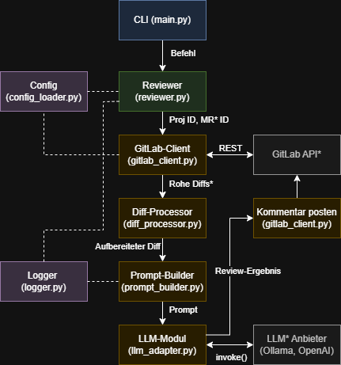

# Architektur

Dieses Dokument beschreibt die Systemarchitektur, den Datenfluss und die zentralen Entwurfsentscheidungen des KI-basierten Merge Request Review Assistenten.

## High-Level Architektur

Die Applikation ist als modular aufgebautes Kommandozeilen-Tool (CLI) in Python realisiert. Sie folgt einem linearen Datenfluss: 

Datenbeschaffung -> Datenaufbereitung -> KI-Analyse -> Ergebnisbereitstellung

## Modulbeschreibung

Die Applikation nutzt eine flache Modulstruktur im src/ -Verzeichnis

- **main.py (CLI):** Nutzt das Click-Framework als Einstiegspunkt. Nimmt Parameter wie Project-ID, MR-ID und das --dry-run Flag entgegen.

- **reviewer.py (Reviewer):** Das Herzstück der Orchestrierung. Kontrolliert den synchronen Ablauf, startet den Zeitmesser, fängt Fehler ab und loggt den Status.

- **gitlab_client.py (GitLab-Client):** Abstrahiert die python-gitlab API. Holt Metadaten und Diffs ab und veröffentlicht am Ende den Kommentar mit dem [AI-Review]-Prefix.

- **diff_processor.py (Diff-Processor):** Wandelt die rohen JSON-Diff Daten von GitLab in einen für die KI lesbaren Text um. Ignoriert gelöschte Dateien und fügt Zeilennummern aus den Hunk-Headern hinzu.

- **prompt_builder.py (Prompt-Builder):** Erstellt den zweiteiligen Prompt. Der System-Prompt definiert die Rolle und die 6 Kategorien. Der User-Prompt integriert die MR-Metadaten und den aufbereiteten Diff.

- **llm_adapter.py (LLM-Modul):** Baut auf LangChain auf. Implementiert ein Fabrikmuster (Factory Pattern), um anhand der Konfiguration dynamisch eine ChatOllama oder ChatOpenAI Instanz zu generieren.

- **config_loader.py & logger.py (Utilities):** Zentrale Module für die Typisierung/Validierung der Umgebungsvariablen und strukturiertes, detailliertes Logging via structlog.

## Design Entscheidungen

- **LangChain als Orchestrator:** Anstatt HTTP-Requests an LLMs manuell zu bauen, wird LangChain als Abstraktionsschicht genutzt. Ein Wechsel von einem lokalen Modell (Ollama) auf ein cloud-basiertes Modell (OpenRouter) benötigt so keine Codeänderungen.

- **Fail-Open Prinzip:** Fällt das LLM aus oder gibt es ein Timeout, fängt der Reviewer den Fehler ab, loggt ihn detailliert und beendet das Skript kontrolliert. Der zugrundeliegende Merge Request kann dadurch nicht blockiert oder gestört werden.

- **Sicherheit & Interne-Daten:** Durch die Standardkonfiguration auf Ollama kann das Tool in gekapselten Unternehmensnetzwerken laufen. Der Sourcecode wird nie an externe Drittanbieter gesendet.